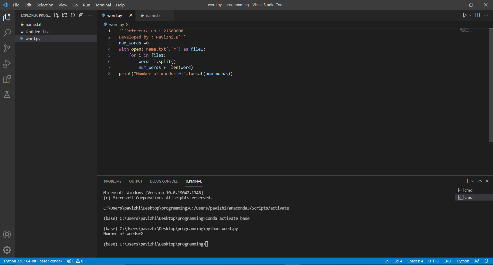
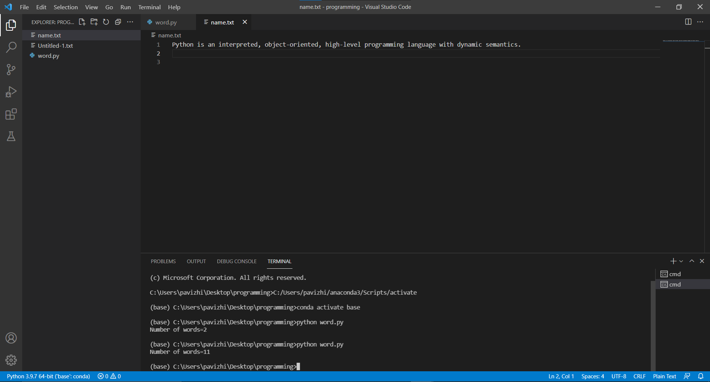

# Word-count
## AIM:
To write a python program for getting the word count from a file.
## EQUIPEMENT'S REQUIRED: 
PC
Anaconda - Python 3.7
## ALGORITHM: 
### Step 1:
Create a txt file to count the number of word in that file.

### Step 2:
Open the txt file in read mode using open(). 
 
### Step 3: 
Using split() function to split the words in the txt file and count it. 

### Step 4:  
Save the python program using .py extention.

### Step 5: 
Run the python program in terminal to get the output. 

### Step 6: 
Number of words in the txt file is displayed as the output.

## PROGRAM:
```
'''Reference no : 21500608
Developed by : Pavizhi.B'''
num_words =0
with open('name.txt','r') as file1:
    for i in file1:
        word =i.split()
        num_words += len(word)
print("Number of words={0}".format(num_words))
```

### OUTPUT:





## RESULT:
Thus the program is written to find the word count from a file.
